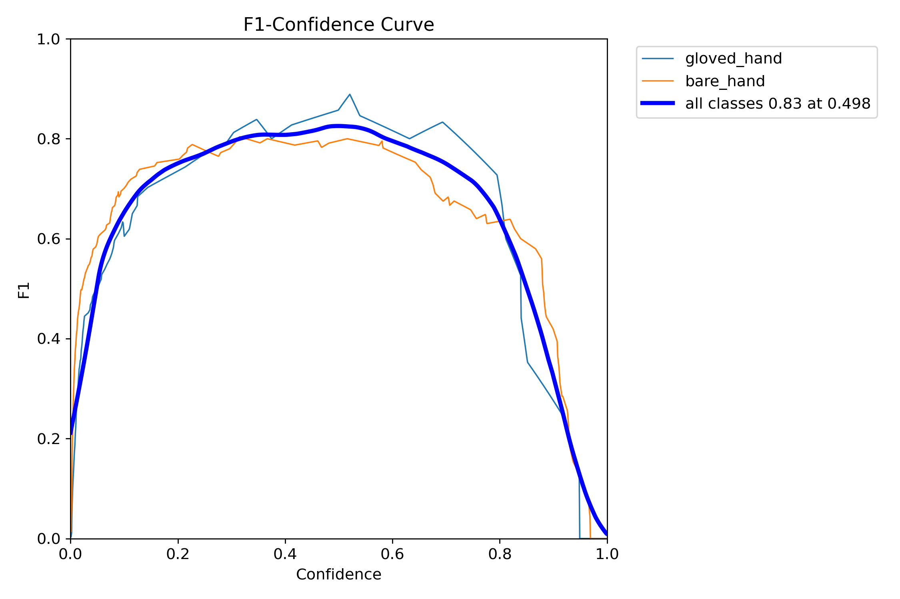
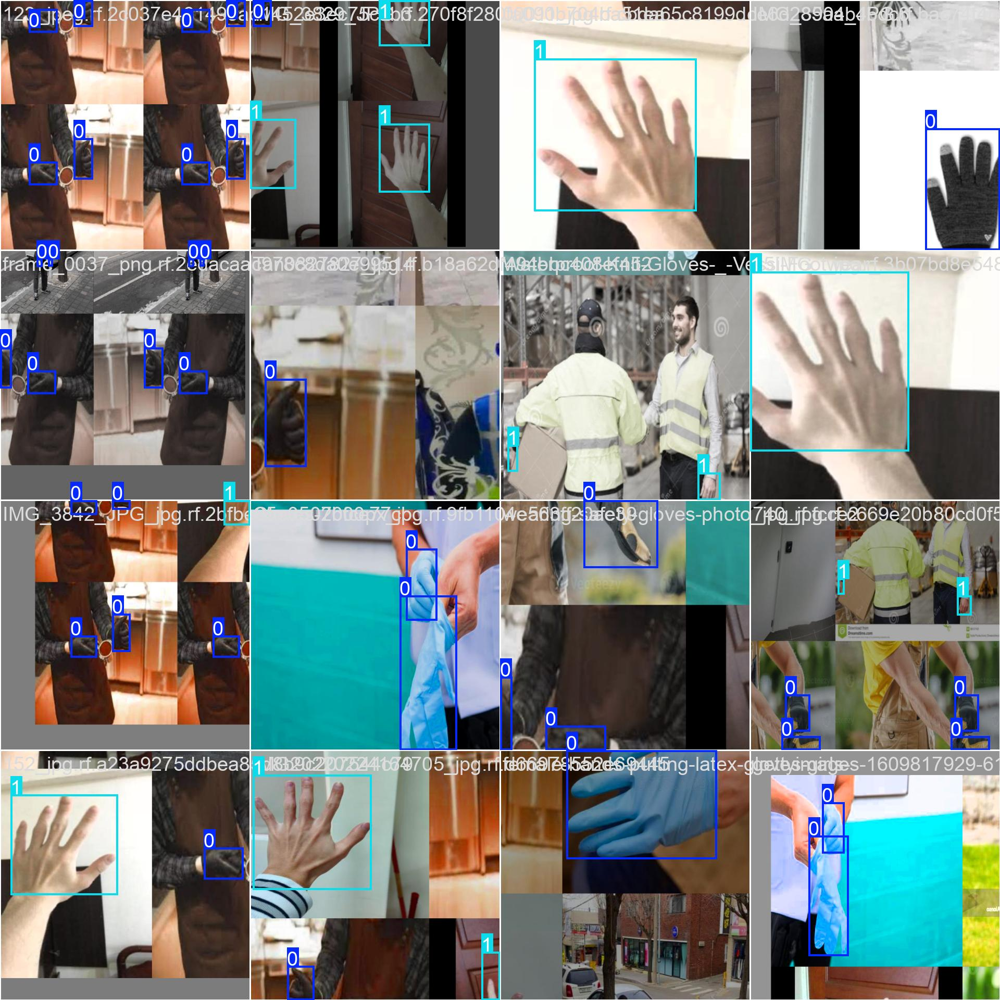
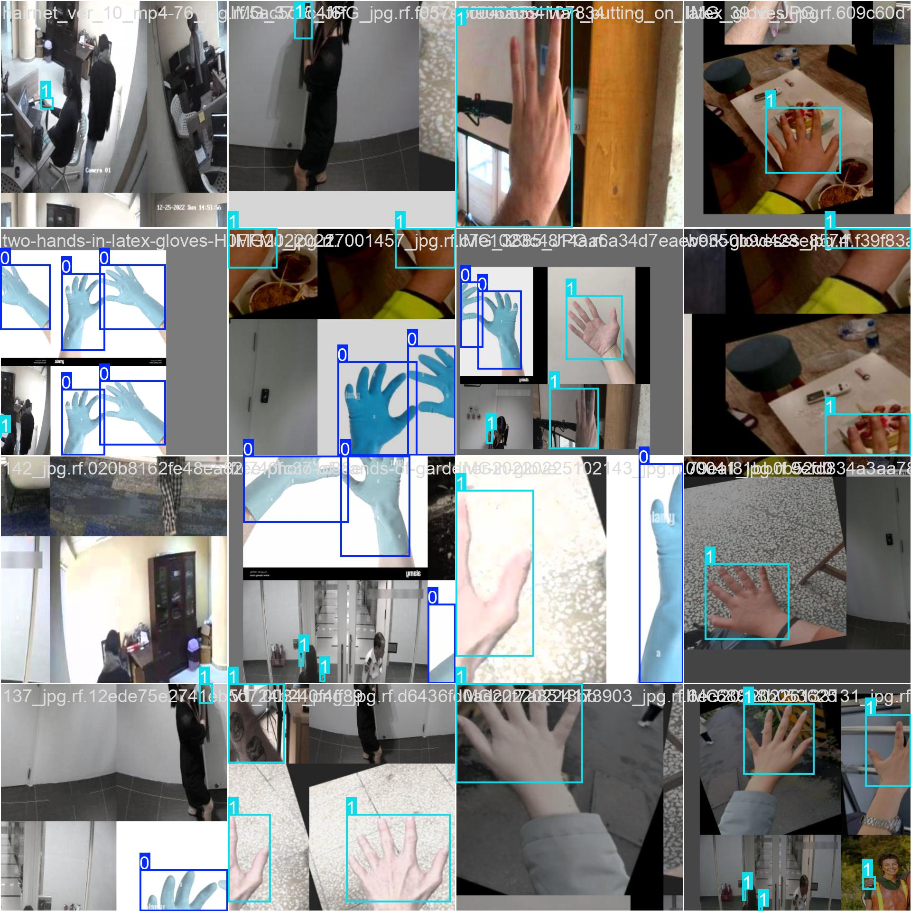
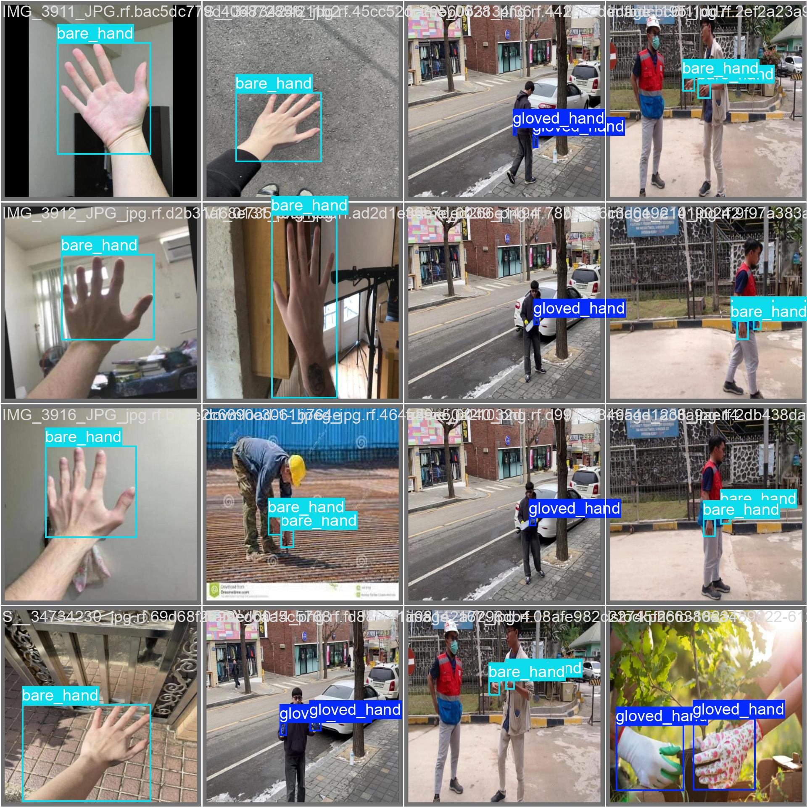

# Part 1: Gloved vs Ungloved Hand Detection

## Project Overview

This project implements a safety compliance system that detects whether workers are wearing gloves using computer vision. The system can process images, videos, and live camera feeds to identify gloved hands and bare hands in real-time, making it suitable for deployment in factory environments to monitor PPE compliance.

## Dataset

**Dataset Name:** Hand Glove Detection Dataset

**Source:** Roboflow Universe - https://universe.roboflow.com/eshwaran/hand-glove-zixup/dataset/1

**License:** CC BY 4.0

**Dataset Details:**
- Training images: 305
- Validation images: 51
- Test images: Available
- Classes: 2 (gloved_hand, bare_hand)
- Total instances: 541 (479 training + 62 validation)

The dataset was sourced from Roboflow Universe and contains diverse images of hands with and without gloves in various industrial and real-world settings. The images include different lighting conditions, angles, and backgrounds to ensure robust model performance.

## Model Architecture

**Model Used:** YOLOv8 Nano (yolov8n.pt)

**Framework:** Ultralytics YOLOv8

**Key Specifications:**
- Base model: YOLOv8n pretrained weights
- Input size: 640x640
- Total parameters: 3,011,238
- GFLOPs: 8.2
- Architecture layers: 129

**Training Configuration:**
- Epochs: 25
- Batch size: 16
- Optimizer: AdamW (lr=0.001667, momentum=0.9)
- Image augmentation: Albumentations (Blur, MedianBlur, ToGray, CLAHE)
- Device: CUDA (Tesla T4 GPU)
- Mixed Precision: Enabled (AMP)

## Training Process

The model was trained from scratch using transfer learning with YOLOv8n pretrained weights. The training process included:

1. **Data Preprocessing:**
   - Image resizing to 640x640
   - Automatic augmentation using Albumentations library
   - Label cache creation for faster training

2. **Training Strategy:**
   - Started with pretrained YOLOv8n weights
   - Transferred 319/355 items from pretrained weights
   - Used mosaic augmentation for first 15 epochs
   - Applied data augmentation throughout training

3. **Optimization:**
   - Automatic optimizer selection (AdamW chosen)
   - Learning rate: 0.001667
   - Weight decay: 0.0005
   - Cosine learning rate scheduling

## Model Performance

**Final Metrics (Best Model - Epoch 24):**
- **Overall mAP@0.5:** 87.6%
- **Overall mAP@0.5:0.95:** 58.3%
- **Precision:** 85.2%
- **Recall:** 80.4%

**Class-wise Performance:**
- **Gloved Hand:**
  - Precision: 86.5%
  - Recall: 85.7%
  - mAP@0.5: 93.0%
  - mAP@0.5:0.95: 58.5%

- **Bare Hand:**
  - Precision: 84.7%
  - Recall: 75.0%
  - mAP@0.5: 82.1%
  - mAP@0.5:0.95: 58.1%

**Inference Speed:**
- Preprocessing: 8.9ms
- Inference: 7.9ms
- Postprocessing: 4.2ms
- **Total:** ~21ms per image (~48 FPS)

### Training Visualizations

The following graphs show the training progress and model performance:

**Training Metrics:**


**Sample Training Batches:**



**Validation Results:**


## Project Structure

```
Part_1_Gloves_detection/
├── detection_script.py          # Main detection script
├── model_weight/
│   └── best.pt                  # Trained YOLOv8 model weights
├── output/
│   ├── images/                  # Annotated output images
│   ├── video/                   # Annotated output videos
│   └── camera/                  # Camera mode outputs
├── logs/
│   ├── images/                  # JSON logs for image detections
│   ├── video/                   # JSON logs for video detections
│   └── camera/                  # JSON logs for camera detections
└── README.md                    # This file
```

## Features

1. **Multi-mode Detection:**
   - Image mode: Process folders of images
   - Video mode: Process video files
   - Camera mode: Real-time detection from webcam

2. **Visual Feedback:**
   - Color-coded bounding boxes (Red: bare_hand, Green: gloved_hand)
   - Confidence scores displayed on each detection
   - Detection counter overlay

3. **Logging System:**
   - JSON logs for each processed frame/image
   - Timestamp tracking
   - Confidence scores and bounding box coordinates

4. **Configurable Parameters:**
   - Adjustable confidence threshold
   - Camera selection for live mode
   - Optional display window
   - Custom input/output paths

## Installation

### Prerequisites
```bash
Python 3.8 or higher
CUDA-capable GPU (optional, for faster inference)
```

### Required Libraries
```bash
pip install ultralytics
pip install opencv-python
pip install torch torchvision
```

Or install all dependencies at once:
```bash
pip install ultralytics opencv-python torch torchvision
```

## Usage

The detection script supports three modes: image, video, and camera.

### 1. Image Mode

Process a folder of images:

```bash
python detection_script.py --mode image --input path/to/images/folder --output output/images --logs logs/images --weights model_weight/best.pt --confidence 0.25 --display
```

**Parameters:**
- `--mode`: Set to "image"
- `--input`: Path to folder containing input images (.jpg, .jpeg, .png)
- `--output`: Directory to save annotated images
- `--logs`: Directory to save JSON detection logs
- `--weights`: Path to trained model weights
- `--confidence`: Detection confidence threshold (default: 0.4, recommended: 0.25)
- `--display`: Optional flag to show output window during processing

### 2. Video Mode

Process a video file:

```bash
python detection_script.py --mode video --input path/to/video.mp4 --output output/video --logs logs/video --weights model_weight/best.pt --confidence 0.25 --display
```

**Parameters:**
- `--mode`: Set to "video"
- `--input`: Path to input video file
- `--output`: Directory to save annotated video
- `--logs`: Directory to save JSON detection logs (per frame)
- `--weights`: Path to trained model weights
- `--confidence`: Detection confidence threshold
- `--display`: Optional flag to show video playback during processing

### 3. Camera Mode

Real-time detection from webcam:

```bash
python detection_script.py --mode camera --camera-id 0 --output output/camera --logs logs/camera --weights model_weight/best.pt --confidence 0.25 --display
```

**Parameters:**
- `--mode`: Set to "camera"
- `--camera-id`: Camera device ID (default: 0 for primary webcam)
- `--output`: Directory to save captured frames (every 30th frame)
- `--logs`: Directory to save JSON detection logs
- `--weights`: Path to trained model weights
- `--confidence`: Detection confidence threshold
- `--display`: Automatically enabled in camera mode

**Controls:**
- Press 'q' to quit camera mode

## Output Format

### Annotated Images

Annotated images are saved with:
- Bounding boxes around detected hands
- Color coding: Green for gloved_hand, Red for bare_hand
- Confidence scores displayed above each detection
- Detection counter in top-left corner

### JSON Log Format

Each detection generates a JSON log file with the following structure:

```json
{
  "source": "image",
  "filename": "image1.jpg",
  "timestamp": "2026-01-03T10:30:45.123456",
  "detections": [
    {
      "label": "gloved_hand",
      "confidence": 0.92,
      "bbox": [150, 200, 300, 450]
    },
    {
      "label": "bare_hand",
      "confidence": 0.85,
      "bbox": [400, 180, 550, 420]
    }
  ]
}
```

**Fields:**
- `source`: Detection source (image/video/camera)
- `filename`: Original filename or frame identifier
- `timestamp`: ISO format timestamp
- `detections`: Array of detected objects
  - `label`: Class name (gloved_hand or bare_hand)
  - `confidence`: Detection confidence score (0-1)
  - `bbox`: Bounding box coordinates [x1, y1, x2, y2]

## Sample Results

Sample annotated images are available in the `output/images/` directory, demonstrating the model's performance on various test cases.

### Detection Examples

The model successfully detects:
- Single and multiple hands in the same frame
- Hands at various angles and distances
- Different types of gloves (rubber, fabric, latex)
- Various lighting conditions and backgrounds

## What Worked

1. **Transfer Learning:** Using pretrained YOLOv8n weights significantly improved training speed and final accuracy.

2. **Data Augmentation:** Albumentations library provided robust augmentation techniques (blur, median blur, grayscale conversion, CLAHE) that improved model generalization.

3. **Confidence Threshold Tuning:** Lowering the confidence threshold from 0.4 to 0.25 improved detection recall in real-world scenarios while maintaining acceptable precision.

4. **Mixed Precision Training:** AMP (Automatic Mixed Precision) reduced training time without sacrificing accuracy.

5. **Class Balance:** The dataset had good representation of both classes, leading to balanced performance.

6. **Real-time Performance:** The YOLOv8n model achieved ~48 FPS on GPU and ~5 FPS on CPU, making it suitable for real-time applications.

## Challenges and Solutions

1. **Challenge:** Initial camera integration issues on Windows
   - **Solution:** Added `cv2.CAP_DSHOW` backend and proper camera initialization with warm-up frames

2. **Challenge:** Lower detection confidence in live camera mode compared to static images
   - **Solution:** Adjusted confidence threshold and added better lighting recommendations

3. **Challenge:** Motion blur in video/camera modes
   - **Solution:** Recommended stable hand positioning and adequate lighting; model still performs reasonably well

4. **Challenge:** Small hand detection at a distance
   - **Solution:** Model performs best when hands are closer to camera; recommended optimal camera positioning

## Performance Optimization

The system includes several optimizations:

1. **Batch Processing:** Images are processed efficiently with minimal overhead
2. **Selective Frame Saving:** In camera mode, only every 30th frame is saved to reduce disk I/O
3. **Optimized Inference:** Uses CUDA when available for GPU acceleration
4. **Efficient Logging:** JSON logs are written asynchronously to avoid blocking inference

## Limitations

1. **Distance Dependency:** Detection accuracy decreases when hands are far from the camera
2. **Occlusion Handling:** Partially occluded hands may not be detected reliably
3. **Environmental Sensitivity:** Performance can vary with extreme lighting conditions
4. **Glove Variety:** Very thin or transparent gloves may be misclassified

## Future Improvements

1. **Model Enhancements:**
   - Train on larger dataset with more diverse glove types
   - Experiment with YOLOv8m or YOLOv8l for better accuracy
   - Add more augmentation techniques for robustness

2. **Feature Additions:**
   - Multi-camera support for industrial settings
   - Alert system for bare hand detection
   - Statistics dashboard for compliance monitoring
   - Database integration for long-term tracking

3. **Performance Optimization:**
   - Implement TensorRT optimization for faster inference
   - Add multi-threading for batch processing
   - Optimize for edge devices (Raspberry Pi, Jetson Nano)

## System Requirements

**Minimum:**
- Python 3.8+
- 4GB RAM
- CPU with SSE4.2 support
- 2GB disk space

**Recommended:**
- Python 3.9+
- 8GB+ RAM
- NVIDIA GPU with CUDA support
- 5GB disk space

## Troubleshooting

**Issue: Camera not detected**
- Solution: Check camera ID (try 0, 1, 2), ensure camera drivers are installed, close other applications using the camera

**Issue: Low detection accuracy**
- Solution: Adjust confidence threshold (try 0.2-0.3), improve lighting conditions, ensure hands are clearly visible

**Issue: Slow inference**
- Solution: Use GPU if available, reduce input image size, use YOLOv8n instead of larger models

**Issue: Import errors**
- Solution: Install dependencies using pip, ensure correct Python version, check CUDA compatibility

## License

This project uses:
- Dataset: CC BY 4.0 License
- YOLOv8: AGPL-3.0 License
- Code: MIT License (or specify your license)

## Acknowledgments

- Ultralytics team for YOLOv8 framework
- Roboflow for dataset hosting and annotation tools
- OpenCV community for computer vision tools

## Author

**Gaurang Chaturvedi**

---

